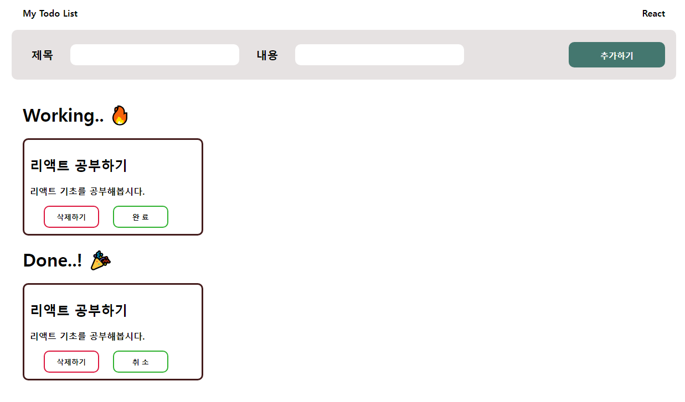

- (1) 프로젝트 셋업
- Vite 를 이용해서 리액트 프로젝트를 셋업합니다.

- (2) Dummy UI 그리기
    - 적절한 css 파일에서 Layout 넓이 (1200px x 800px) 설정부터 합니다.
    - 본인이 원하는 디자인대로 html(jsx), css만으로 우선 UI를 그립니다. (예시 디자인을 따라하셔도 좋습니다.)

- (3) Todo 추가하기 구현하기
    - useState 를 이용해서 todo 상태를 정의합니다.
    - 추가하기 버튼 클릭 시 Working 파트로 투두 카드가 추가됩니다.

- (4) Todo 삭제하기 구현하기
    - 특정 투두카드의 삭제버튼 클릭 시 삭제처리가 됩니다.

- (5) Todo 완료상태 변경하기
    - 투두 카드의 완료버튼 클릭 시 Working 파트에서 Done 파트로 카드가 이동하며 “완료”텍스트가 ”취소” 텍스트로 변경됩니다.
    - 반대로 “취소” 버튼을 클릭하면 Done파트에서 Working 파트로 투두 카드가 이동되며 “완료” 텍스트가 나옵니다.

- (6) 작성한 코드에서 보완할 부분 찾아보기
    - 투두리스트가 예외사항없이 잘 동작하는 지 직접 테스트 해보고 확인해 봅니다.
    - 컴포넌트 분리 등 리팩터링 할 수 있는 부분이 없는 지 살펴봅니다.